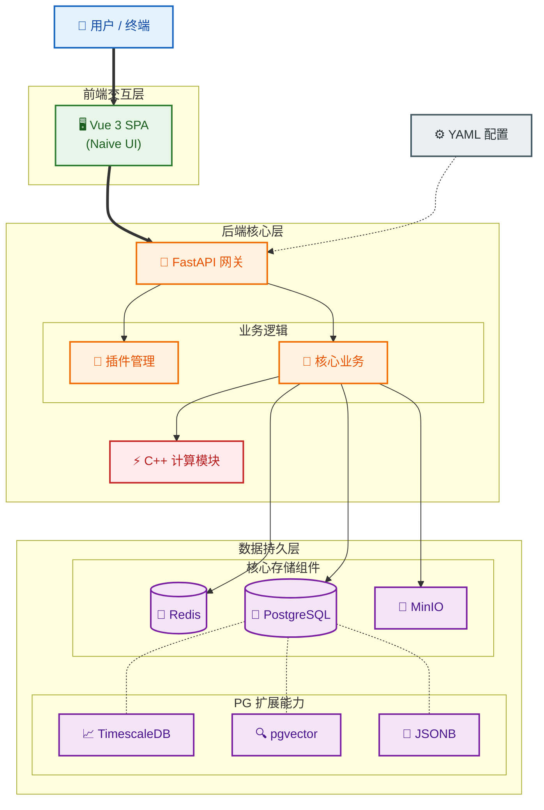

# 📚 Sanmu Dashboard 系统设计文档

## 🎯 核心愿景
打造一个以数据为核心的个人技术帝国基石。
集成 **数据采集 (爬虫)**、**高性能处理 (C++)**、**智能分析 (AI)**、**工作流自动化** 与 **可视化大屏** 于一体的 B/S 架构系统。

## 🧱 技术栈选型 (已定稿)

| 模块 | 技术方案 | 选择理由 |
| :--- | :--- | :--- |
| **架构模式** | **B/S (前后端分离)** | 支持远程访问，生态成熟，易于扩展。 |
| **前端 (UI)** | **Vue 3** + **TypeScript** | 响应式性能好，TypeScript 提供类型安全，Vite 极速构建。 |
| **组件库** | **Naive UI** | 尤雨溪推荐，原生支持 Vue 3，暗黑模式精美，适合极客风格。 |
| **可视化** | **Apache ECharts** | 强大的图表渲染能力 (K线、热力图、3D地球)，满足大屏和实验数据展示需求。 |
| **后端 (API)** | **FastAPI (Python 3.10+)** | 现代、高性能 (ASGI)，完美对接 Python 数据科学与 AI 生态。 |
| **高性能核心** | **C++ (Pybind11)** | 处理密集计算任务 (金融指标、图像处理)，封装为 Python 模块。 |
| **配置管理** | **YAML** | 静态配置 (如插件开关、系统参数) 使用 YAML 文件管理，实现 GitOps。 |
| **数据库** | **PostgreSQL** (全能核心) | **业务数据**: 关系型表 **配置**: JSONB **时序数据**: TimescaleDB 插件 **向量检索**: pgvector 插件 (AI 实验) |
| **缓存/队列** | **Redis** | 实时大屏缓存、Celery 任务队列 Broker。 |
| **文件存储** | **本地文件系统 / MinIO** | 存储爬虫抓取的 HTML、PDF、图片及模型权重文件 (.pt)。 |
| **构建工具** | **Vite** (前端) / **CMake** (C++) | Vite 处理 Web 资源，CMake 管理 C++ 编译流程。 |

## 🏗️ 系统架构设计

### 🗺️ 总体架构图

## ⚙️ 核心特性设计

### 🧾 配置驱动 (Configuration as Code)
*   **原则**: 核心配置（如爬虫目标、频率）写在 `config/*.yaml` 中，受 Git 版本控制。
*   **实现**: 后端启动时读取 YAML，Web 界面主要用于展示和临时操作，不直接修改 YAML 文件。

### 🗄️ 全能数据库策略
*   **PostgreSQL**: 作为单一事实来源 (Single Source of Truth)。
    *   **实验记录**: 使用 `JSONB` 存储超参数。
    *   **训练曲线**: 使用 `TimescaleDB` 存储 Loss/Accuracy。
    *   **RAG/搜索**: 使用 `pgvector` 存储 Embedding。
*   **Redis**: 仅用于瞬时状态和队列。

### 🔌 插件系统
*   后端扫描 `plugins/` 目录，结合 `config/plugins.yaml` 决定是否加载。
*   支持热插拔（软性），插件可拥有独立的 API 路由和定时任务。

