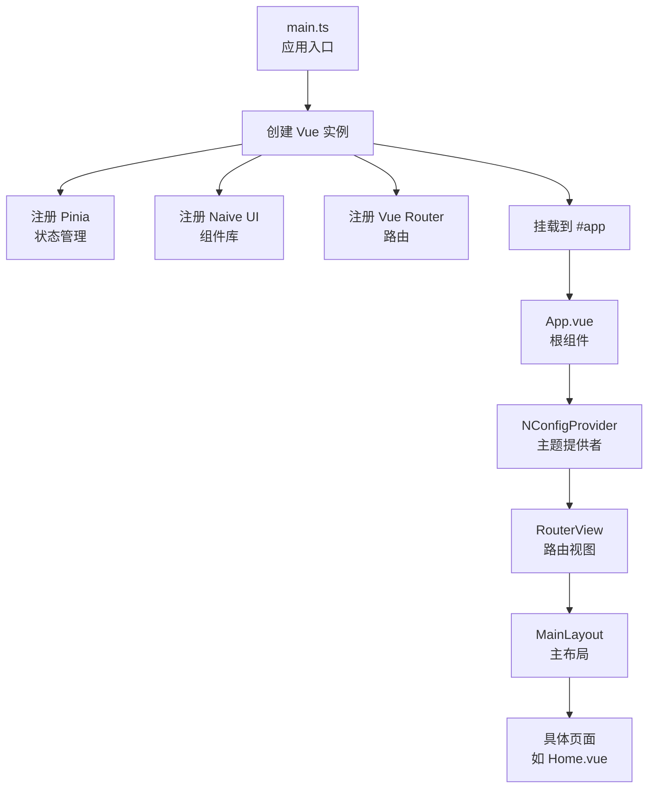
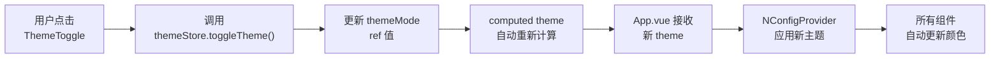
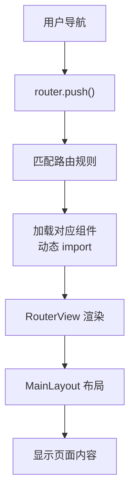
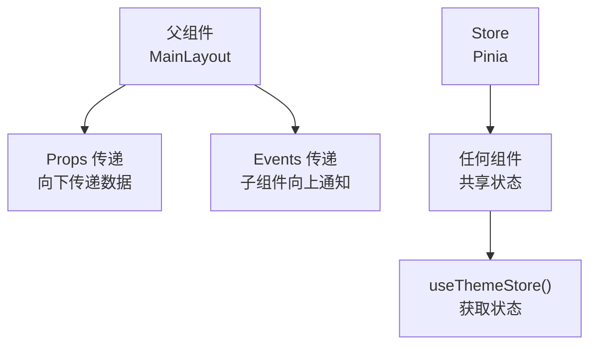

# 🎨 前端架构说明

## 📋 目录结构

```
src/frontend/src/
├── main.ts              # 应用入口（初始化 Vue、Pinia、Router）
├── App.vue              # 根组件（主题提供者）
├── router/              # 路由配置
│   └── index.ts
├── store/               # 状态管理（Pinia）
│   └── theme.ts         # 主题状态管理
├── layouts/             # 布局组件
│   └── MainLayout.vue   # 主布局（五区域布局）
├── components/          # 通用组件
│   ├── layout/          # 布局相关组件
│   │   ├── TopBar.vue
│   │   ├── LeftSidebar.vue
│   │   ├── RightSidebar.vue
│   │   └── BottomPanel.vue
│   ├── icons/           # 图标组件
│   │   └── Icon.vue
│   └── ThemeToggle.vue  # 主题切换组件
├── views/               # 页面组件
│   └── Home.vue         # Home 页面
└── api/                 # API 接口（待创建）
```

---

## 🔄 核心逻辑流程

### 1. **应用启动流程**



**代码流程：**
```typescript
// main.ts
1. createApp(App)          // 创建 Vue 应用
2. app.use(pinia)          // 注册状态管理
3. app.use(naive)          // 注册 UI 组件库
4. app.use(router)         // 注册路由
5. app.mount('#app')       // 挂载到 DOM
```

---

### 2. **主题切换流程**



**关键代码：**

```typescript
// store/theme.ts - 状态管理
const themeMode = ref<'dark' | 'light'>('dark')  // 响应式状态

const theme = computed(() => {                   // 计算属性
  return themeMode.value === 'dark' ? darkTheme : lightTheme
})

// App.vue - 应用主题
const { theme } = storeToRefs(themeStore)        // 获取响应式主题
<n-config-provider :theme="theme">              // 绑定到 Naive UI
```

**响应式原理：**
- `ref()` 创建响应式数据
- `computed()` 自动追踪依赖，当 `themeMode` 变化时自动重新计算
- Vue 的响应式系统自动更新所有使用 `theme` 的组件

---

### 3. **路由切换流程**



**路由配置：**
```typescript
// router/index.ts
{
  path: '/',
  component: MainLayout,      // 布局组件
  children: [
    { path: '', component: Home }  // 子路由
  ]
}
```

---

### 4. **组件通信流程**



**通信方式：**
1. **Props 向下传递**：父组件 → 子组件
2. **Events 向上通知**：子组件 → 父组件
3. **Store 全局共享**：任何组件都可以访问

---

## 🔌 后端接口对接

### 1. **创建 API 服务**

创建 `src/frontend/src/api/index.ts`：

```typescript
import axios from 'axios'

// 创建 axios 实例
const apiClient = axios.create({
  baseURL: '/api',              // 基础 URL（会被 vite proxy 代理）
  timeout: 10000,               // 超时时间
  headers: {
    'Content-Type': 'application/json'
  }
})

// 请求拦截器（添加 token 等）
apiClient.interceptors.request.use(
  (config) => {
    // 可以在这里添加 token
    // const token = localStorage.getItem('token')
    // if (token) {
    //   config.headers.Authorization = `Bearer ${token}`
    // }
    return config
  },
  (error) => {
    return Promise.reject(error)
  }
)

// 响应拦截器（统一处理错误）
apiClient.interceptors.response.use(
  (response) => {
    return response.data  // 直接返回 data
  },
  (error) => {
    // 统一错误处理
    if (error.response) {
      switch (error.response.status) {
        case 401:
          // 未授权，跳转登录
          break
        case 403:
          // 无权限
          break
        case 500:
          // 服务器错误
          break
      }
    }
    return Promise.reject(error)
  }
)

export default apiClient
```

---

### 2. **创建具体的 API 接口**

创建 `src/frontend/src/api/dashboard.ts`：

```typescript
import apiClient from './index'

// 定义响应类型
export interface DashboardData {
  totalUsers: number
  totalRevenue: number
  charts: ChartData[]
}

export interface ChartData {
  id: string
  type: 'line' | 'bar' | 'pie'
  data: any
}

// API 接口函数
export const dashboardApi = {
  // 获取仪表盘数据
  getDashboardData: () => {
    return apiClient.get<DashboardData>('/dashboard')
  },
  
  // 获取图表数据
  getChartData: (chartId: string) => {
    return apiClient.get<ChartData>(`/charts/${chartId}`)
  },
  
  // 更新图表配置
  updateChartConfig: (chartId: string, config: any) => {
    return apiClient.put(`/charts/${chartId}`, config)
  }
}
```

---

### 3. **在组件中使用 API**

**示例：在 Home.vue 中获取数据**

```typescript
// views/Home.vue
<script setup lang="ts">
import { ref, onMounted } from 'vue'
import { dashboardApi } from '../api/dashboard'
import type { DashboardData } from '../api/dashboard'

const dashboardData = ref<DashboardData | null>(null)
const loading = ref(false)

// 加载数据
const loadData = async () => {
  loading.value = true
  try {
    const data = await dashboardApi.getDashboardData()
    dashboardData.value = data
  } catch (error) {
    console.error('加载数据失败:', error)
    // 可以使用 Naive UI 的消息提示
    // window.$message?.error('加载数据失败')
  } finally {
    loading.value = false
  }
}

// 组件挂载时加载数据
onMounted(() => {
  loadData()
})
</script>

<template>
  <div class="home-container">
    <n-spin :show="loading">
      <div v-if="dashboardData">
        <!-- 使用数据 -->
        <h1>总用户数: {{ dashboardData.totalUsers }}</h1>
      </div>
    </n-spin>
  </div>
</template>
```

---

### 4. **使用 Store 管理 API 数据**

创建 `src/frontend/src/store/dashboard.ts`：

```typescript
import { defineStore } from 'pinia'
import { ref } from 'vue'
import { dashboardApi, type DashboardData } from '../api/dashboard'

export const useDashboardStore = defineStore('dashboard', () => {
  const data = ref<DashboardData | null>(null)
  const loading = ref(false)
  const error = ref<string | null>(null)
  
  // 加载数据
  const fetchData = async () => {
    loading.value = true
    error.value = null
    try {
      data.value = await dashboardApi.getDashboardData()
    } catch (err: any) {
      error.value = err.message || '加载失败'
    } finally {
      loading.value = false
    }
  }
  
  // 重置数据
  const reset = () => {
    data.value = null
    error.value = null
  }
  
  return {
    data,
    loading,
    error,
    fetchData,
    reset
  }
})
```

**在组件中使用 Store：**

```typescript
// views/Home.vue
<script setup lang="ts">
import { onMounted } from 'vue'
import { useDashboardStore } from '../store/dashboard'

const dashboardStore = useDashboardStore()

onMounted(() => {
  dashboardStore.fetchData()
})
</script>

<template>
  <div>
    <n-spin :show="dashboardStore.loading">
      <div v-if="dashboardStore.data">
        {{ dashboardStore.data.totalUsers }}
      </div>
    </n-spin>
  </div>
</template>
```

---

## 🔧 Vite 代理配置

**`vite.config.ts` 已配置代理：**

```typescript
server: {
  proxy: {
    '/api': {
      target: 'http://localhost:8000',  // 后端地址
      changeOrigin: true,
      // rewrite: (path) => path.replace(/^\/api/, '')  // 可选：重写路径
    }
  }
}
```

**使用方式：**
- 前端请求：`/api/dashboard` 
- 实际请求：`http://localhost:8000/api/dashboard`

---

## 📝 添加新接口的步骤

### 步骤 1：定义接口类型
```typescript
// api/types.ts
export interface UserInfo {
  id: number
  name: string
  email: string
}
```

### 步骤 2：创建 API 函数
```typescript
// api/user.ts
import apiClient from './index'
import type { UserInfo } from './types'

export const userApi = {
  getUserInfo: (id: number) => {
    return apiClient.get<UserInfo>(`/users/${id}`)
  },
  
  updateUser: (id: number, data: Partial<UserInfo>) => {
    return apiClient.put(`/users/${id}`, data)
  }
}
```

### 步骤 3：在组件中使用
```typescript
// views/UserProfile.vue
import { userApi } from '../api/user'

const loadUser = async () => {
  const user = await userApi.getUserInfo(1)
  console.log(user)
}
```

---

## 🎯 最佳实践

1. **API 统一管理**：所有接口放在 `api/` 目录
2. **类型定义**：使用 TypeScript 定义请求/响应类型
3. **错误处理**：统一在拦截器中处理
4. **Loading 状态**：使用 `n-spin` 显示加载状态
5. **数据缓存**：使用 Store 缓存数据，避免重复请求

---

## 🔗 相关文件

- **状态管理**：`src/frontend/src/store/theme.ts`
- **路由配置**：`src/frontend/src/router/index.ts`
- **API 配置**：`src/frontend/src/api/index.ts`（待创建）
- **Vite 配置**：`src/frontend/vite.config.ts`

